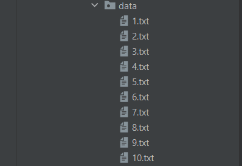
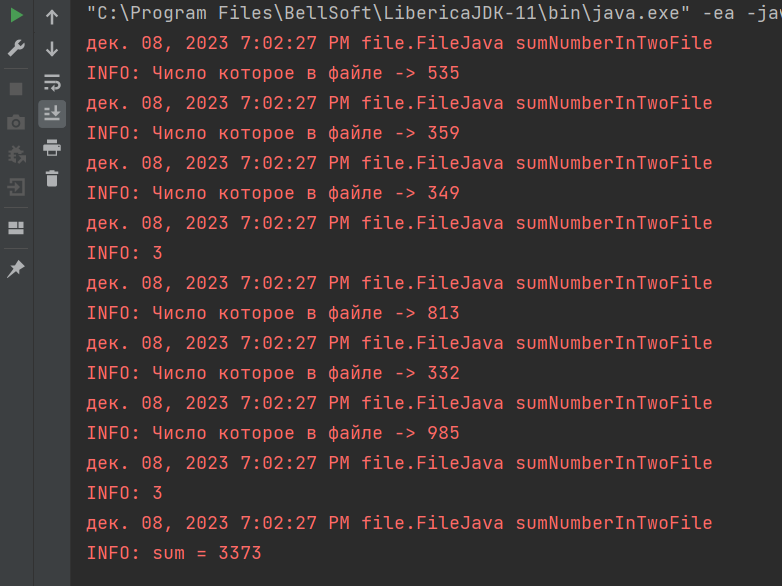
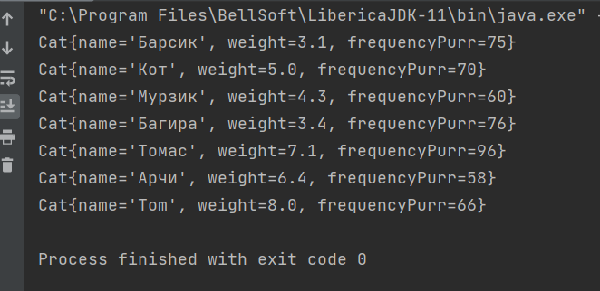
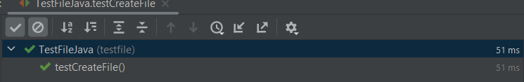

# Работа с файлами в Java

1. В первом задании нужно было создать 10 текстовых файлов,
и заполнить их 3 случайными числами.

Создал их с помощью метода createFile, где я с помощью BufferWriter создаю файлы, и c Random записываю три случайных числа.  

#### Созданные Файлы

------------------

2. Во втором задании нужно взять два случайных файла созданных в прошлом задании, и просуммировать все числа которые в них находятся.
   Если числа имеют некорректный формат, или числа больше-меньше 3, то вывести ошибку.

   
 Это задание я решил в методе sumNumberInTwoFile(), где я с помощью BufferReader читаю файлы, и суммирую все числа. Корректность чисел я проверяю в методе isInteger(String st). 

#### Результат суммирования

-------------------------

3. В третьем задании есть текстовой файл с набором данных кота. С помощью этого набора нужно создать список объектов класса кот.
    

Сначала я создал класс Cat, где я описал поля которые есть в текстовом файле. Потом в классе Main в методе listCat() я с помощью BufferReader читаю строки,
и методом split() делая из строки массив, и элементами этого массива создаю объект Cat, и кладу эти объекты в список. Корректность данных проверяю в методах isInteger(String st), isDouble(String st).

#### Список котов

-----------------------------

### Тесты

Я написал тест который проверяет создание файла и проверяет количество записанных чисел в него. 

